# MAS Cloud Agent - 多智能体销售对话系统

> 基于 LangGraph 构建的智能销售对话系统，模拟真人美容顾问"{{}}"，通过多轮对话、情感分析和策略调整，最终引导用户完成到店预约。
> # 批注
> 原来代码没有带出来，只保留了较早期版本。由于当时代码规范不强，不太好看，我对该仓库做以下解析：
> 涉及到公司信息的文字已用"{{}}"代替。
> ## 我的代码：
> agents\user_profile目录
> rag目录
> 描述：RAG是我根据原理复刻的。原因：原langchain框架不支持多模态，检索规则相对固定，无法胜任业务场景。
> agents\marketing_assistant目录
> 其中react_agent模式是我根据原langgraph的各流程节点复刻的，原因：原langgrap的react_agent框架类似黑盒子，每一步节点怎么走无法由用户提示词准确控制。
> #(以下是我写的功能，同事合并进来的)
> agents\persona_config目录
> 人设配置，随时更新。
> scripts目录：原本是我个人小工具，同事觉得好用就合并进来了。
> 作用：更新对话thread状态，即可从外界添加人机对话，也可清除对话中的脏数据，重置坏线程。
>为什么会有坏线程：大量脏话、AI越界词出现的时候，该thread的对话会变得不遵从提示词，无法正常回复。
> 
> #以下是已经分散在同事代码中，难以辨别的功能：
> 对话管理：
> 原本这是个亮点：
> 保存近十轮对话、强调近三轮，十轮外的对话总结压缩；
> 语音、文本、图片的识别与发送、主动触发。


由于该仓库代码管理混乱：本人已在阅读代码设计、重构相关书籍。
后续维护：重构代码，完善功能，将langgraph全部替换为fastapi接口，结合前后端，以桌面桌宠即时互动的形式展现。


## 📋 目录

- [系统概述](#系统概述)
- [核心架构](#核心架构)
- [关键模块详解](#关键模块详解)
- [快速开始](#快速开始)
- [部署指南](#部署指南)
- [开发指南](#开发指南)
- [API使用](#api使用)
- [文件结构](#文件结构)
- [故障排除](#故障排除)

## 🎯 系统概述

MAS Cloud Agent 是一个专为销售场景设计的复杂对话系统，具备以下核心特性：

### ✨ 核心特色
- **多阶段对话策略**: 从初步接触到最终邀约的完整销售流程
- **动态情感分析**: 实时分析客户信任、舒适度等七个维度情感状态
- **并行响应生成**: 同时生成多个候选回复，通过评估模型选出最优回复
- **智能策略调整**: 根据客户意向等级动态调整对话策略
- **云原生设计**: 专为 LangGraph Cloud 优化，支持一键部署
- **多模型支持**: 支持 OpenAI、Claude、本地模型、Together.ai 等多种模型

### 🤖 系统特点
- **人格化交互**: 模拟真人"{{}}"的对话风格和语言习惯
- **情感智能**: 七维情感状态追踪（安全感、熟悉感、舒适感等）
- **策略自适应**: 根据客户意向（低/中/高/伪高）动态调整对话策略
- **可观测性**: 内置调试模式和详细日志记录

## 🏗️ 核心架构

### 状态图结构

系统采用基于 LangGraph 的状态图架构，包含5个核心节点：

```mermaid
graph TD
    A[initialize_state<br/>初始化状态] --> B[analyze_sentiment<br/>情感分析]
    B --> C[meta_design<br/>策略设计]
    C --> D[generate_and_evaluate<br/>生成与评估]
    D --> E[self_verify<br/>自我验证]
    E --> F((END))

    subgraph "状态数据流"
        G[Agentstate<br/>- messages: 对话历史<br/>- emotional_state: 情感状态<br/>- current_stage: 当前阶段<br/>- candidate_actions: 候选行动]
    end

    style A fill:#e6f7ff,stroke:#91d5ff,stroke-width:2px
    style C fill:#fff2e8,stroke:#ffb366,stroke-width:2px
    style F fill:#f6ffed,stroke:#b7eb8f,stroke-width:2px
```



### 节点功能详解

1. **initialize_state** - 状态初始化
   - 处理用户输入转换为消息格式
   - 设置默认状态值和模型配置
   - 增加对话轮次计数

2. **analyze_sentiment** - 情感分析
   - 基于当前情感状态动态调整模型温度
   - 影响回复的创造性和风格

3. **meta_design** - 策略设计（核心大脑）
   - 调用状态评估器分析客户情感和意向
   - 根据信任度推进对话阶段
   - 生成候选行动列表

4. **generate_and_evaluate** - 并行生成与评估
   - 并行调用多个对话模块生成候选回复
   - 使用独立评估模型对回复质量打分

5. **self_verify** - 自我验证
   - 从高质量回复中选择最佳响应
   - 更新对话历史

## 🔧 关键模块详解

### 1. 状态管理 (`common.py`)

**Agentstate** - 系统状态定义
```python
class Agentstate(TypedDict):
    messages: List[BaseMessage]          # 对话历史
    current_stage: str                   # 当前对话阶段
    emotional_state: Emotionalstate      # 七维情感状态
    customer_intent_level: str           # 客户意向等级
    candidate_actions: List[str]         # 候选行动
    # ... 更多字段
```

**Emotionalstate** - 七维情感模型
```python
@dataclass
class Emotionalstate:
    security_level: float      # 安全感 (0-1)
    familiarity_level: float   # 熟悉感 (0-1)
    comfort_level: float       # 舒适感 (0-1)
    intimacy_level: float      # 亲密感 (0-1)
    gain_level: float          # 获得感 (0-1)
    recognition_level: float   # 认同感 (0-1)
    trust_level: float         # 信任感 (0-1)
```

### 2. 对话能力模块 (`blocks/`)

**架构设计**
- **BaseBlock**: 所有对话模块的基础类
- **对话模块**: 实现特定对话能力的具体类
- **工厂模式**: 通过 `create_block()` 动态创建模块实例

**核心对话模块**
```python
# 基础能力模块
GreetingBlock          # 问候
RapportBuildingBlock   # 建立关系
NeedsAnalysisBlock     # 需求分析
ValueDisplayBlock      # 价值展示

# 意向驱动模块
PainPointTestBlock     # 痛点测试（低意向）
ValuePitchBlock        # 价值抛投（中意向）
ActiveCloseBlock       # 主动成交（高意向）
ReverseProbeBlock      # 反向试探（伪高意向）
```

### 3. 模型采样器 (`sampler/`)

**SamplerFactory** - 动态模型管理
- 支持多种模型提供商（OpenAI、本地模型、Together.ai）
- 自动缓存采样器实例
- 根据模型名称智能选择适配器

```python
# 支持的模型格式示例
"gpt-4o"                        # OpenAI 模型
"claude-sonnet-4-20250514"      # Claude 4 模型 (通过 AiHubMix)
"claude-3-5-sonnet-20241022"    # Claude 3.5 模型 (通过 AiHubMix)
"qwen2:7b"                      # 本地模型
"together/mistral-7b"           # Together.ai 模型
```

### 4. 提示词管理 (`prompts/`)

**智能加载机制**
- `base_context.txt`: 全局上下文，自动注入所有提示词
- 各模块独立提示词文件
- `loader.py`: 统一加载和拼接逻辑

**提示词模板变量**
```python
{message_history}  # 格式化的对话历史
{current_stage}    # 当前对话阶段
{user_profile}     # 用户画像信息
```

### 5. 状态评估器 (`blocks/state_evaluator.py`)

**功能**
- 分析对话历史评估客户情感状态
- 判断客户意向等级（low/medium/high/fake_high）
- 返回结构化的评估结果

**工作流程**
1. 格式化对话历史
2. 加载评估提示词模板
3. 调用LLM进行结构化评估
4. 解析JSON结果返回状态更新

## 🚀 快速开始

### 环境要求
- Python 3.11+
- 推荐使用虚拟环境

### 1. 安装依赖
```bash
# 克隆项目
git clone <your-repo-url>
cd MAS_clould

# 创建虚拟环境
python -m venv .venv
source .venv/bin/activate  # Linux/Mac
# .venv\Scripts\activate   # Windows

# 安装依赖
pip install -r requirements.txt
```

### 2. 配置环境变量

**重要更新**: 所有Agent现在都使用OpenAI模型，无需配置Google Cloud或其他复杂的API。

```bash
# 必需配置 - OpenAI API密钥
export OPENAI_API_KEY="sk-..."             # OpenAI 模型 (必需)

# 可选配置 - 其他模型提供商
export ANTHROPIC_API_KEY="your-key"        # Anthropic Claude
export TOGETHER_API_KEY="your-key"         # Together.ai
export AIHUBMIX_API_KEY="your-key"         # AiHubMix (支持 Claude 4、o3 等模型)

# 可选配置 - 模型选择
NODE_MODEL="gpt-4o"                        # 对话生成模型 (默认 gpt-4o)
FEEDBACK_MODEL="gpt-4o-mini"               # 评估模型 (默认 gpt-4o-mini)
VLLM_BASE_URL="http://localhost:8000/v1"   # 本地模型API

# 可选配置 - 调试追踪
LANGSMITH_API_KEY="your-key"               # LangSmith 追踪
LANGSMITH_PROJECT="mas-clould-agents"
LANGCHAIN_TRACING_V2=true
```

或者创建 `.env` 文件：
```env
OPENAI_API_KEY=sk-your-openai-api-key-here
ANTHROPIC_API_KEY=your-anthropic-key-here
TOGETHER_API_KEY=your-together-key-here
LANGSMITH_API_KEY=your-langsmith-key-here
LANGSMITH_PROJECT=mas-clould-agents
LANGCHAIN_TRACING_V2=true
```

### 3. 测试 Claude 4 模型（推荐）
```bash
# 测试 Claude 4 模型集成
python test_claude4_model.py
```

### 4. 本地测试
```bash
# 启动交互式对话
python graph.py
```

## ☁️ 部署指南

### LangGraph Cloud 部署

1. **准备代码**
```bash
git add .
git commit -m "Ready for deployment"
git push origin main
```

2. **创建部署**
- 访问 [LangSmith](https://smith.langchain.com/)
- 进入 LangGraph Platform
- 创建新部署，选择 GitHub 仓库
- 系统自动识别 `langgraph.json` 配置

3. **配置环境变量**
在部署面板中设置所有必需的环境变量

### Docker 部署（可选）
```dockerfile
FROM python:3.11-slim
WORKDIR /app
COPY requirements.txt .
RUN pip install -r requirements.txt
COPY . .
CMD ["python", "graph.py"]
```

## 💻 开发指南

### 添加新的对话模块

1. **创建模块类**
```python
# blocks/conversation_blocks.py
class NewBlock(BaseBlock):
    def __init__(self, sampler: Any, node_model: str):
        super().__init__("new_block", sampler, node_model)

    def forward(self, conversation_history: list, temperature: float) -> str:
        prompt_template = load_prompt(self.block_name)
        prompt = prompt_template.format(message_history=_format_messages(conversation_history))
        # ... 实现具体逻辑
        return response
```

2. **注册模块**
```python
# blocks/__init__.py
BLOCK_REGISTRY = {
    # ... 现有模块
    "new_block": NewBlock,
}
```

3. **创建提示词**
```text
# prompts/new_block.txt
你是专业的销售顾问{{}}...
根据以下对话历史：
{message_history}

生成合适的回复...
```

### 修改对话策略

在 `graph.py` 的 `meta_design_node` 函数中修改策略逻辑：

```python
def meta_design_node(state: Graphstate) -> Dict[str, Any]:
    # 获取客户意向
    customer_intent = evaluation_result.get("customer_intent_level", "low")
    
    # 根据意向调整候选行动
    if customer_intent == "low":
        candidate_actions.extend(["pain_point_test", "needs_analysis"])
    elif customer_intent == "medium":
        candidate_actions.extend(["value_pitch", "value_display"])
    # ... 更多策略
```

### 调试技巧

1. **启用详细模式**
```python
inputs = {"user_input": "你好", "verbose": True}
```

2. **查看内部状态**
```python
snapshot = app.get_state(config)
print(snapshot.values["internal_monologue"])
```

3. **模块单独测试**
```python
from blocks import create_block
from sampler.factory import SamplerFactory

sampler, _ = SamplerFactory.get_sampler_and_cost("gpt-4o")
block = create_block("greeting", sampler, "gpt-4o")
response = block.forward(messages, 0.7)
```

## 📡 API 使用

### 输入格式
```json
{
  "messages": [
    {"type": "human", "content": "你好，我想咨询一下"}
  ],
  "verbose": false
}
```

### 输出格式
```json
{
  "last_message": "您好！我是{{}}，有什么可以帮助您的吗？"
}
```

### Python 调用示例
```python
import requests

response = requests.post(
    "https://your-deployment-url/invoke",
    json={
        "messages": [{"type": "human", "content": "你好"}],
        "verbose": True
    }
)

result = response.json()
print(result["last_message"])
```

## 📁 文件结构

```
MAS_clould/
├── 📄 graph.py                    # 核心状态图定义
├── 📄 common.py                   # 状态和数据结构定义
├── 📄 langgraph.json             # LangGraph Cloud 配置
├── 📄 requirements.txt           # Python 依赖
├── 📄 utils.py                   # 工具函数
├── 📄 test_claude4_model.py       # Claude 4 模型测试脚本
│
├── 📁 blocks/                    # 对话能力模块
│   ├── 📄 __init__.py           # 模块注册和工厂函数
│   ├── 📄 base.py               # 基础模块类
│   ├── 📄 conversation_blocks.py # 具体对话模块实现
│   └── 📄 state_evaluator.py    # 状态评估器
│
├── 📁 prompts/                   # 提示词模板
│   ├── 📄 loader.py             # 提示词加载器
│   ├── 📄 base_context.txt      # 全局上下文
│   ├── 📄 greeting.txt          # 问候提示词
│   ├── 📄 needs_analysis.txt    # 需求分析提示词
│   └── 📄 ...                   # 其他提示词文件
│
└── 📁 sampler/                   # 模型采样器
    ├── 📄 factory.py            # 采样器工厂
    ├── 📄 chat_completion_sampler.py  # OpenAI 采样器
    ├── 📄 claude_sampler.py     # Claude 原生采样器
    ├── 📄 aihubmix_sampler.py   # AiHubMix 采样器
    └── 📄 ...                   # 其他采样器实现
```

## 🔍 故障排除

### 常见问题

**Q: 模型调用失败**
```bash
错误：无法获取评估模型的采样器
```
**A**: 检查环境变量配置，确保 API Key 正确设置

**Q: 提示词加载失败**
```bash
Error: Prompt file not found
```
**A**: 确保 `prompts/` 目录下存在对应的 `.txt` 文件

**Q: JSON 解析错误**
```bash
评估解析失败
```
**A**: 检查模型返回格式，可能需要调整 `response_format` 参数

**Q: Claude 4 模型调用失败**
```bash
❌ Claude API 调用最终失败
```
**A**: 
1. 检查 `AIHUBMIX_API_KEY` 环境变量是否正确设置
2. 确认 API Key 有效且有足够余额
3. 检查网络连接，AiHubMix 需要访问外网
4. 运行 `python test_claude4_model.py` 进行详细诊断

**Q: Claude 模型返回空响应**
```bash
⚠️ Claude 因安全原因拒绝生成内容
```
**A**: Claude 4 引入了新的拒绝停止原因，检查提示词是否包含敏感内容

### 性能优化

1. **并行调用优化**: 调整 `ThreadPoolExecutor` 的 `max_workers` 参数
2. **模型选择**: 根据需求选择合适的模型（速度 vs 质量）
3. **缓存机制**: 采样器实例已自动缓存，避免重复创建

### 日志调试

启用 verbose 模式查看详细执行流程：
```python
config = {"configurable": {"thread_id": "debug-session"}}
inputs = {"user_input": "测试消息", "verbose": True}
```

---

## 👥 团队协作

### 开发分工建议
- **对话策略**: 修改 `meta_design_node` 的决策逻辑
- **模块开发**: 在 `blocks/conversation_blocks.py` 中添加新模块
- **提示词优化**: 修改 `prompts/` 目录下的模板文件
- **模型集成**: 在 `sampler/factory.py` 中添加新模型支持

### Git 工作流
1. 从 `main` 分支创建功能分支
2. 完成开发后提交 PR
3. 代码审查通过后合并
4. 部署到测试环境验证

### 代码规范
- 遵循 PEP 8 编码规范
- 函数和类添加详细注释
- 关键模块提供使用示例
- 提交信息使用约定式提交格式

**现在，您的团队已经有了一个全面的开发和协作指南！** 🎉


# AIpeopleandteam
语音识别、语音合成、RAG、AGent、langgraph、拟人化聊天
